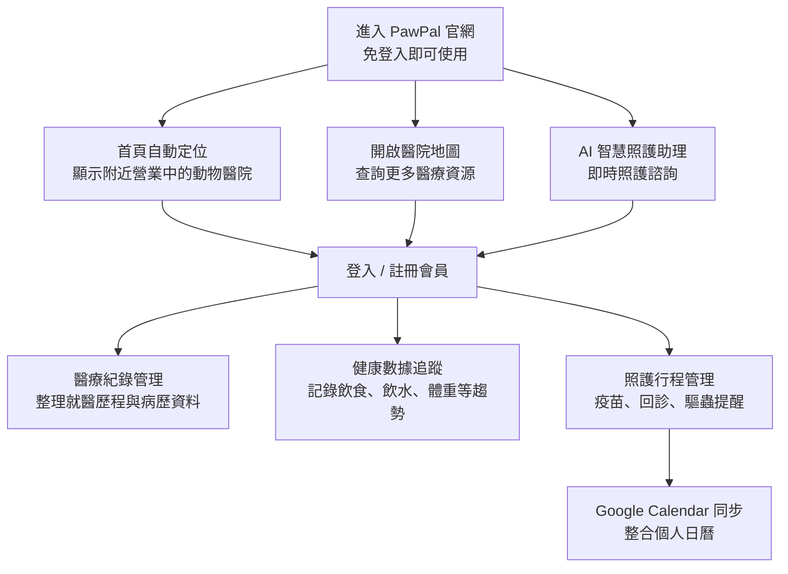
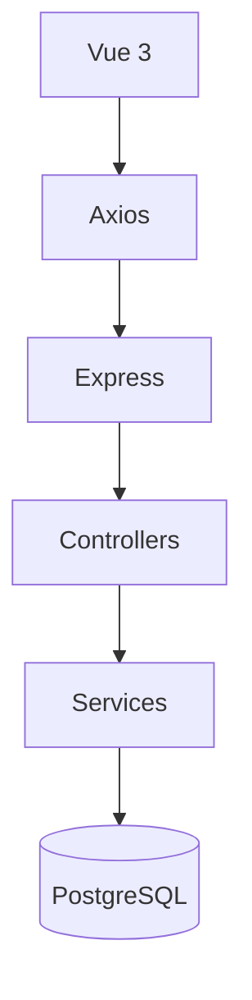

# PawPal | 寵物即時照護平台 🐾

「深夜突發不慌張，PawPal給毛孩一個溫柔的擁抱。」

"An intelligent pet care platform built for modern families."

[](https://www.pawpal.tech/)

## ABOUT PLATFORM

PawPal 是一個以即時醫療導航為核心的一站式寵物照護平台，整合醫院搜尋、健康管理、照護紀錄與 AI 輔助服務，協助飼主建立完整的毛孩健康管理流程。

當深夜或突發狀況發生時，使用者可立即查詢附近營業中的動物醫院；登入後，則能持續管理毛孩的醫療紀錄、健康數據與照護行程，並透過 AI 助理取得日常照護建議，建立完整且連續的健康管理流程。

## FEATURES

### 1. 即時醫療導航 (Medical Navigator)

- **快速搜尋附近動物醫院：** 根據使用者位置篩選距離最近、目前營業中且評價良好的動物醫院，協助在突發狀況下快速找到合適的醫療資源。
- **評論與收藏管理：** 提供使用者評論與評分功能，協助參考就醫經驗；支援一鍵收藏常用醫院，建立個人的緊急就醫名單。

### 2. 結構化就醫紀錄 (Medical Logs)

- **完整醫療紀錄管理：** 建立結構化病歷與就醫紀錄，方便整理毛孩的診療歷程，並提升與獸醫溝通的效率。
- **病歷與影像存檔：** 支援上傳病歷文件、血液檢查報告及相關照片，集中保存各項醫療資料。

### 3. 健康數據追蹤 (Health Data Tracking)

- **日常健康紀錄：** 記錄每日飲食、飲水、排泄及體重等健康數據，協助建立完整的生活紀錄。
- **視覺化趨勢分析：** 透過折線圖與柱狀圖呈現健康變化趨勢，方便觀察長期成長狀況與日常異動。

### 4. 儀表板日程與 Google Calendar同步 (Pet Dashboard Calendar)

- **多寵物行程管理：** 支援依不同毛孩建立專屬行事曆，並可依疫苗、回診、驅蟲等照護需求進行分類管理。
- **提醒與 Google Calendar 同步：** 提供日程提醒功能，並支援 Google Calendar 同步，讓照護行程整合至個人日曆。

### 5. AI 智慧照護助理 (AI Care Assistant)

- **AI 即時照護諮詢：** 提供飲食建議、日常照護、異常行為觀察及常見症狀等諮詢服務，協助飼主即時獲得照護建議與初步風險評估。

## PLATFORM FLOW

PawPal 採用「免登入即可使用緊急醫療導航，登入後享有完整健康管理」的雙軌流程，讓使用者能依照當下需求快速取得服務。



## ENVIRONMENT SUPPORT

### Client Side

- **Modern Browsers：** Chrome、Safari、Edge、Firefox（最新兩個穩定版本）
- **Responsive Design：** 支援桌面、平板及行動裝置瀏覽

### Runtime & Package Manager

- **Node.js：** `^20.19.0` 或 `>=22.12.0`（支援 ES Modules）
- **Package Manager：** npm `v10+` 或 pnpm `v9+`

### Database Engine

- PostgreSQL：v14.0 或更高版本（託管於 Supabase 或本地端原生 PostgreSQL）

## TECH STACK

#### Frontend Core<br />


#### Routing & State Management<br />


#### Visualization & Components<br />


#### AI Engineering & Intelligence<br />


#### Third-party Integration & Authentication<br />


#### Backend Core & Cloud Storage<br />


#### Database, Security & Networking<br />


#### Development Tools & Testing<br />


## PROJECT ARCHITECTURE

本專案採用前後端分離（Frontend / Backend Separation）架構，前端負責使用者介面與互動體驗，後端則負責 API、商業邏輯、資料驗證及資料存取。透過分層設計，將不同職責拆分至獨立模組，以提升程式碼的可維護性、可讀性與擴充性。

```txt
pawpal/
├── src/                         # Vue 3 Frontend
│   ├── api/                     # API 請求封裝層
│   ├── components/              # 可重用 UI 元件
│   ├── stores/                  # Pinia 狀態管理
│   └── views/                   # 頁面元件
│
└── backend/
    ├── src/
    │   ├── routes/              # API 路由
    │   ├── middlewares/         # JWT 驗證、資料驗證等中介層
    │   ├── controllers/         # Request / Response 處理
    │   ├── services/            # 商業邏輯與資料存取
    │   └── schemas/             # Zod 驗證規則
    │
    └── test/                    # 單元測試與整合測試
```



## DEPLOYMENT & LIVE PREVIEW

- **Live Demo：** [PawPal 官方網站](https://www.pawpal.tech/)
- **Frontend Hosting：** Vercel（Vue 3 前端部署）
- **Backend Hosting：** Render（Express API 服務部署）
- **Database：** Supabase PostgreSQL（資料庫服務）

## SECURITY & PRIVACY

PawPal 重視毛孩健康資料、個人行程與帳戶資訊的安全性，透過多層安全機制保護使用者資料：

- **Secure Password Management：**
  支援原生帳號密碼註冊，使用 Bcrypt 對使用者密碼進行單向雜湊處理，資料庫僅保存不可逆的雜湊結果，避免明文密碼儲存風險。

- **Authentication & API Security：**
  採用 JSON Web Token（JWT）進行使用者身份驗證與 API 存取控制，並透過 Helmet 設定安全 HTTP 標頭，降低常見 Web 安全風險。

- **OAuth 2.0 Integration：**
  LINE Login、Google OAuth 以及 Google Calendar 同步皆採用官方 OAuth 2.0 授權流程，確保第三方服務存取權限受到控管。

- **Data Validation & Protection：**
  後端使用 Zod 進行輸入資料驗證，確保 API 接收資料符合預期格式，降低異常資料造成的安全問題。

## PROJECT HIGHLIGHTS

- 即時附近動物醫院搜尋
- Google Calendar API 行程同步整合
- LINE Login 與 Google OAuth 身分驗證
- 基於 Gemini API 的 AI 寵物照護助理
- 健康數據視覺化分析 Dashboard
- 結構化寵物醫療紀錄管理
